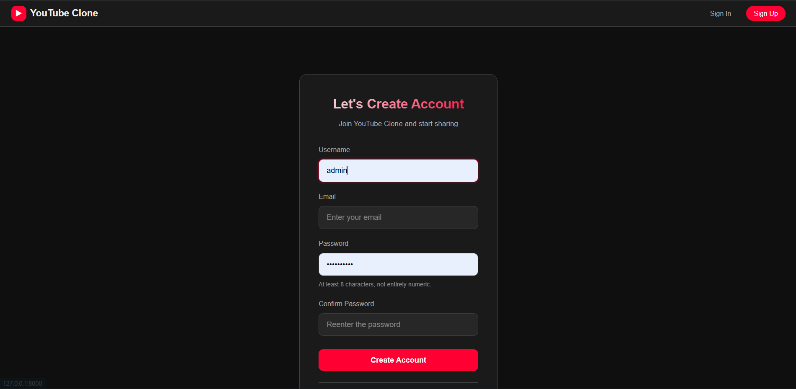
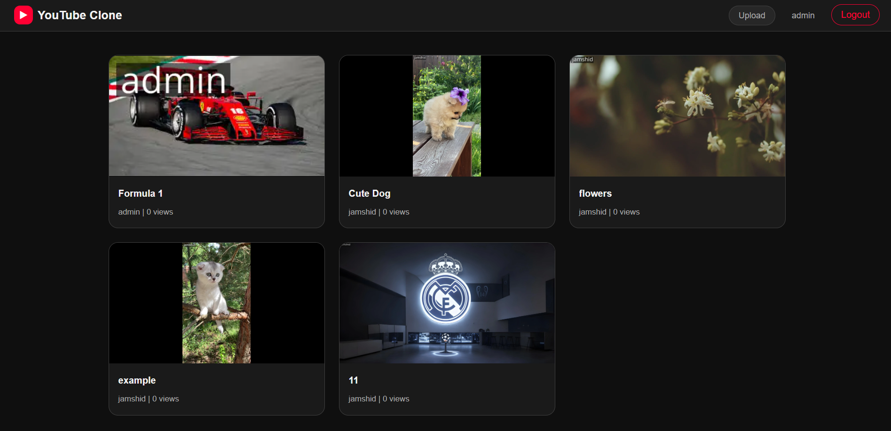
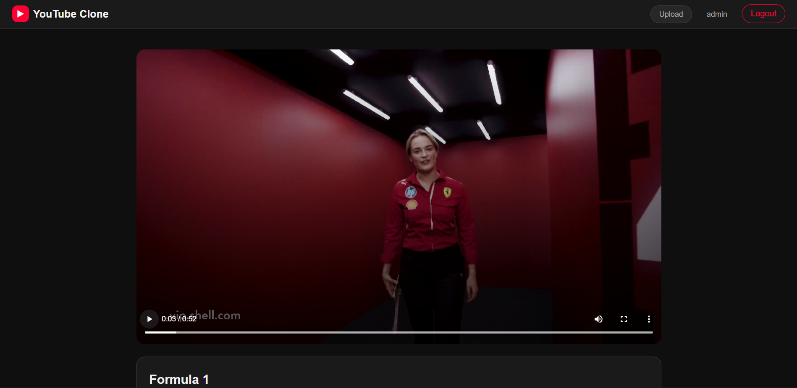
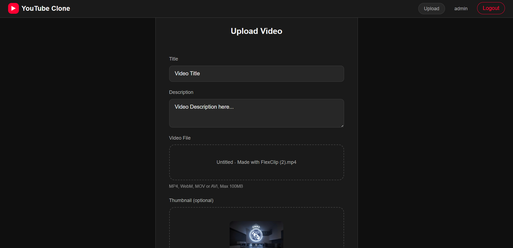
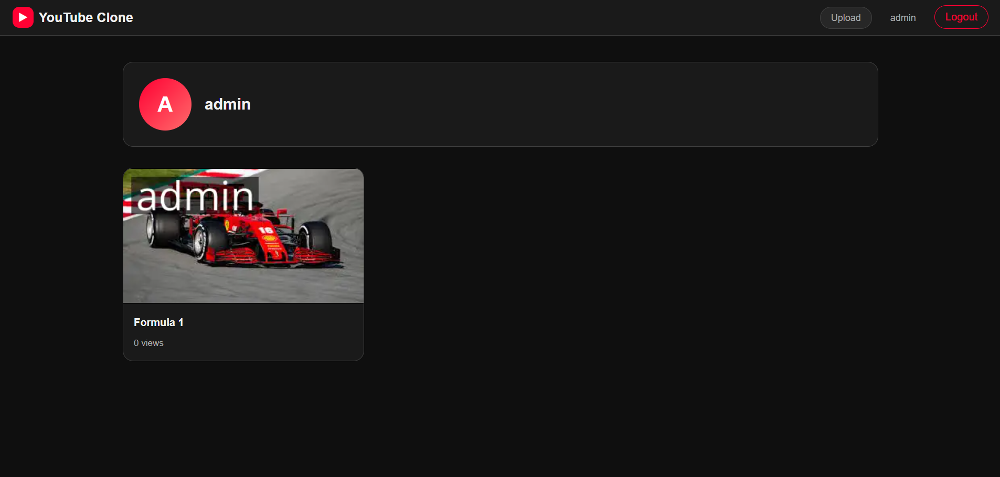
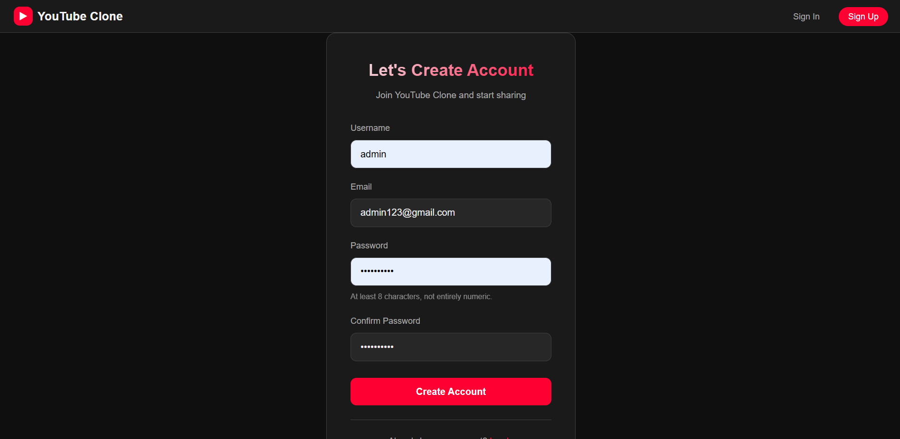
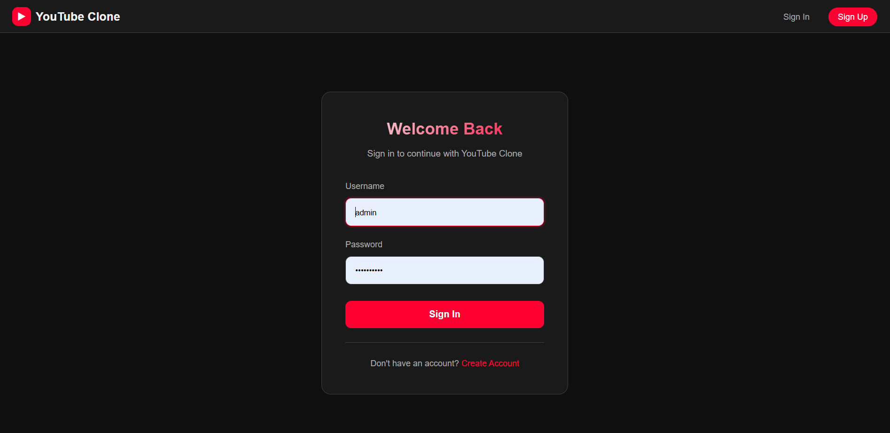

# YouTube Clone

A fully functional YouTube clone built with **Python Django** (backend) and **HTML, CSS, JavaScript** (frontend).

This project replicates the core video-sharing experience of YouTube, including video streaming, uploading, user authentication, and channel management.



## ✨ Features

### Core Features
- **Video Streaming** – Smooth video playback with custom player
- **Video Upload** – Upload videos with title, description, and custom thumbnail
- **Automatic Watermark** – Username watermark automatically added to every uploaded video thumbnail
- **Delete Video** – Only the video author can delete their videos
- **Like & Dislike System** – Users can like or dislike videos
- **User Authentication** – Register, Login, and Logout functionality
- **Channel Page** – Dedicated channel page displaying all videos uploaded by a user

### Access Control
- **Unauthenticated users** can only browse and watch videos
- **Authenticated users** can upload videos, like/dislike, and manage their channel
- **Only the video author** can delete their own videos

## Tech Stack
- **Backend**: Django 6.0
- **Database**: PostgreSQL
- **Media Storage**: AWS S3 + ImageKit (video streaming & CDN)
- **Auth**: Django built-in authentication

### Frontend
- **HTML**
- **CSS3**
- **JavaScript**

### Database
- SQLite

## 🚀 Installation & Setup

### 1. Clone the Repository
```
git clone https://github.com/jamsshid/youtube-clone.git
cd youtube-clone
```
### 2. Install uv (if not already installed)
- Install uv using the official installer

```curl -LsSf https://astral.sh/uv/install.sh | sh```

- Activate virtual environment
```
venv\Scripts\activate          # Windows
# source venv/bin/activate     # Linux / macOS
```
### 3. Create Virtual Environment & Install Dependencies with uv
- Create and sync the virtual environment
```uv sync```

- Activate the virtual environment
```source .venv/bin/activate        # Linux / macOS
# .venv\Scripts\activate         # Windows
```
### 4. Apply Migrations
```
uv run python manage.py makemigrations
uv run python manage.py migrate
```
### 5. Run the Development Server
```
uv run python manage.py runserver
```
Open your browser and navigate to: http://127.0.0.1:8000/

### 📁 Project Structure
```commandline
youtube-clone/
├── youtube/               # Main Django project folder
│   ├── accounts/          # User authentication app
│   ├── videos/            # Main app for video upload, streaming & management
│   ├── static/            # Static files (CSS, JS, images)
│   ├── staticfiles/       # Collected static files
│   ├── templates/         # HTML templates
│   ├── __init__.py
│   ├── asgi.py
│   ├── settings.py
│   ├── urls.py
│   └── wsgi.py
├── .venv/                 # Virtual environment (created by uv)
├── db.sqlite3
├── manage.py
├── .gitignore
├── .python-version
├── pyproject.toml         # uv project configuration
├── uv.lock
├── README.md
```

### 🔐 Authentication Rules

- Guests can watch videos only
- Logged-in users can upload, like, dislike, and manage their channel
- Only the video owner can delete a video

### 📸 Screenshots
## Homepage


## Video Watch Page


## Upload Page


## Channel Page


## Register Page


## Login Page


### 🔮 Future Enhancements
- Comments and replies system
- Advanced video search functionality
- Subscription system
- Dark / Light mode
- Video recommendations
- View count tracking

### 🤝 Contributing
Contributions, issues, and feature requests are welcome!
Feel free to check the issues page.